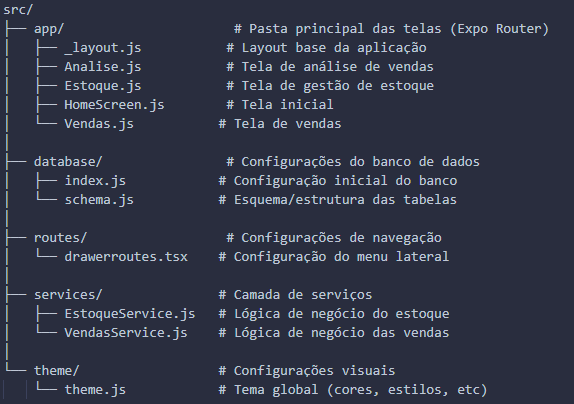

# Mobile App gerencimento de vendas👋

### Disciplina: 9002 - PROGRAMAÇÃO PARA DISPOSITIVOS MÓVEIS EM ANDROID

### Aluna: Jerrayne Rodrigues de Sousa

### Professora: Josyane

## Sobre o projeto

Este projeto foi desenvolvido para atender às necessidades de uma pequena empresa local que realiza vendas no Mercado Livre e iFood. Sabemos que muitos empreendedores enfrentam dificuldades ao lidar com sistemas complexos para acompanhar suas vendas. Pensando nisso, criamos uma solução que se conecta às APIs dessas plataformas e proporciona uma visão clara e intuitiva das vendas, simplificando o acesso a informações como volume de vendas, produtos em alta, e desempenho financeiro. Nosso objetivo é facilitar a gestão de vendas para pessoas que não possuem familiaridade com sistemas, tornando os dados mais acessíveis e úteis para tomadas de decisão.

### Nota sobre o Projeto

<small>Este aplicativo foi desenvolvido com o propósito de estudo e demonstração de conceitos em desenvolvimento mobile. Atualmente, ele não implementa um banco de dados real nem a integração com as APIs do Mercado Livre e iFood. A estrutura foi projetada para simular uma interface intuitiva e funcionalidades básicas que poderiam ser expandidas em um projeto real. O objetivo é oferecer uma visão inicial de como um sistema desse tipo poderia ser utilizado por pequenos empreendedores para acompanhar suas vendas de forma simplificada.</small>

# Veja o aplicativo em ação

[Video-App-IOS.mp4]C:\Users\BlueShift\Desktop\Estacioteste\teste\Video-App-IOS.mp4
---

## Tecnologias Utilizadas

**React Native:** para o desenvolvimento da interface mobile
**Expo:** para simplificar o desenvolvimento e testes
**SQLite:** para um banco de dados local
**API REST (conceitual):** estrutura para integração com Mercado Livre e iFood

## Funcionalidades

* **Visão geral das vendas**
* **Produtos mais vendidos**
* **Análise de desempenho por período**
* **Interface intuitiva para facilitar o acesso a dados de vendas**

## Estrutura do Projeto

## Como Executar o Projeto

Clone o repositório
Instale as dependências com 'npm install'
Inicie o Expo com 'expo start'

## Possíveis Expansões Futuras

* **Integração real com as APIs do Mercado Livre e iFood**
* **Armazenamento de dados em um banco de dados real**
* **Painéis de relatórios mais avançados para análise de vendas**